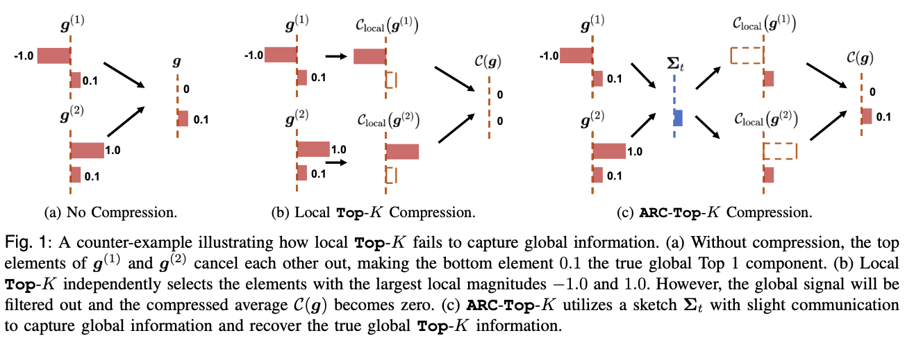
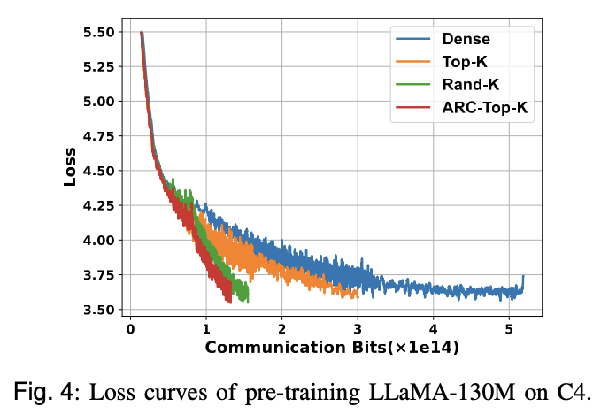
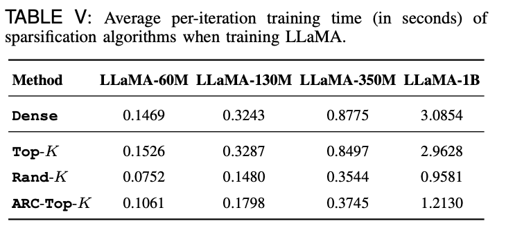

# ARC-TopK

This is the implementation for paper *Communication-Efficient Distributed Learning with All-Reduce Compatible Top-K Compressor*.

Communication remains a central bottleneck in large-scale distributed machine learning, and gradient sparsification has emerged as a promising strategy to alleviate this challenge. 

In this paper, we propose **ARC-Top-K**, an All-Reduce-Compatible Top-K compressor that aligns sparsity patterns across nodes using a lightweight sketch of the gradient, enabling index-free All-Reduce while preserving globally significant information:


We have proved that ARC-Top-K is contractive. Besides, when combined with momentum error feedback (EF21M), it achieves linear speedup and sharper convergence rates than the original EF21M under standard assumptions. 

Experiments on both pre-training and fine-tuning LLMs have shown that arctopK matches the accuracy of TopK with less communication overhead.
<div align="center">
  
</div>


What's more, it reduces wall-clock training time by up to 60.7\%, offering an efficient and scalable solution that combines the robustness of RandK with the strong performance of TopK.
<div align="center">
  
</div>


## Installation

The dependencies are listed in [requirements.txt](https://github.com/Aris-ma/ARC-TopK-release/blob/master/requirements.txt). 

You can install them via::

```
pip install -r requirements.txt
```

Our experiments are conducted with python 3.11 with PyTorch 2.7 on NVIDIA RTX 4090 (24 GB) GPUs

## Reproduce Experiments

### Numerical Experiment

We create a synthetic adversarial benchmark called the Robust Shifted Objective to evaluate ARC-Top-K's resilience in heterogeneous environments with diverse local gradients. 

The main script is [synthetic_release/main.py](https://github.com/Aris-ma/ARC-TopK-release/blob/master/synthetic_release/main.py). You can run the script by 
```
python synthetic_release/main.py
```

### Fine-Tuning RoBERTa on GLUE tasks

The code for GLUE experiments is provided in [glue_fine-tuning](https://github.com/Aris-ma/ARC-TopK-release/tree/master/glue_fine-tuning).

The main script is [run_glue_no_trainer_new.py](https://github.com/Aris-ma/ARC-TopK-release/blob/master/glue_fine-tuning/run_glue_no_trainer_new.py)

An example script is shown below:
```
PYTHONPATH=. accelerate launch glue_fine-tuning/run_glue_no_trainer_new.py \
    --model_name_or_path /data/pretrained_models/roberta-base_1 \
    --task_name qnli \
    --max_length 512 \
    --learning_rate 1e-5 \
    --compressor "group_topk_no_reshape" \
    --use_error_feedback "ef14" \
    --per_device_train_batch_size 4 \
    --seed 1234 \
    --num_train_epochs 30 \
    --with_tracking \
    --report_to wandb \
    --compress_ratio 0.2 \
    --r 4
```

We set `compress_ratio` = 0.2 for all compressors and fix the projection rank at `r` = 4 for ARC-Top-K

Supported error-feedback variants:

* no error feedback(`use_error_feedback`="noef")

* EF21(`use_error_feedback`="ef21")

* EF14(`use_error_feedback`="ef14")

Supported compressors:

* ARC-TopK (`compressor`="group_topk_no_reshape")

* TopK (`compressor`="topk_sync")

* RandK (`compressor`="randk_sync")

* No compression (`compressor`="none")


For reproductibility purposes, we provide the [scripts](https://github.com/Aris-ma/ARC-TopK-release/tree/master/glue_fine-tuning/scripts) . 


### Pre-Training on CIFAR

[run_cifar10.py](https://github.com/Aris-ma/ARC-TopK-release/blob/master/cifar10/run_cifar10.py) is the main script for this task, An example script is shown below:
```
for use_error_feedback in "noef"; do
    for compressor in "none"; do
        for optimizer in "adamw"; do
            for seed in 1410; do
                PYTHONPATH=. torchrun  --nproc_per_node=8 --master-port=29501 cifar10/run_cifar10.py \
                    --lr 1e-3 \
                    --use_wandb 0 \
                    --start_compress_iter 1000 \
                    --weight_decay 5e-4 \
                    \
                    --compressor $compressor \
                    --use_error_feedback $use_error_feedback \
                    --per_device_train_batch_size 32 \
                    --seed $seed \
                    --num_train_epochs 200 \
                    --compress_ratio 0.2 \
                    --col_rank 4 \
                    --optimizer $optimizer
            done
        done
    done
done
```

### Pre-Training on C4

The main script is [run_llama_pretraining.py](https://github.com/Aris-ma/ARC-TopK-release/blob/master/c4/run_llama_pretraining.py). You can use the following script as an example to pretrain LLaMA model:
```
for LEARNING_RATE in 2e-3; do
    for use_error_feedback in ef14; do
        for compressor in "randk_sync"; do 
            # time
            current_time=$(date "+%Y%m%d%H%M%S")
            # tag
            compressor_tag=none-$use_error_feedback-ratio0.2
            output_dir=output/lr$LEARNING_RATE-gc1.0-total_bs256-seed1243-${compressor_tag}-start_compress2000-warmup1000-float32
            echo $compressor_tag
            mkdir -p ${output_dir}
            python -m torch.distributed.run --standalone --nproc_per_node=4 c4/run_llama_pretraining.py \
                --model_config c4/configs/llama_130m.json \
                --max_length 256 \
                --dtype float32 \
                --num_training_steps 10000 \
                --warmup_steps 1000 \
                --total_batch_size 256 \
                --batch_size 32 \
                --gradient_accumulation 2 \
                --save_dir c4/results/Adam/llama_130m/lr_$LEARNING_RATE \
                --seed 1243 \
                \
                --optimizer "adamw" \
                --lr $LEARNING_RATE \
                --beta1 0.9 \
                --beta2 0.999 \
                --eps 1e-8 \
                --weight_decay 0.0 \
                \
                --compressor "none" \
                --start_compress_iter 2000 \
                --use_error_feedback $use_error_feedback \
                --compress_ratio 0.2 \
                \
                --grad_clipping 1.0 \
                \
                --wandb_project "llama_130m" \
                --output_dir $output_dir \
            2>&1 | tee ${output_dir}/output.log
        done
    done
done
```

You can also use [script](https://github.com/Aris-ma/ARC-TopK-release/blob/master/c4/scripts/c4_none_0123.sh) to run it.

#### Hub streaming or local raw C4 shards

By default, `--dataset_path allenai/c4` streams the English split from the Hub. For
repeatable offline runs, download the first 30 English training shards and one
validation shard at the pinned dataset revision with:

```bash
python c4/scripts/download_c4_raw_shards.py \
    --output-dir data/c4/en-30-shards \
    --revision 1588ec454efa1a09f29cd18ddd04fe05fc8653a2
```

The downloader stores raw compressed JSONL only (about 9.6 GB), records the
selected files and sizes in `manifest.json`, and is safe to rerun. Pass a full
40-character commit SHA for `--revision`; the manifest records that revision.
Use the same
local directory for training, for example:

```bash
--dataset_path data/c4/en-30-shards --max_train_tokens 3B
```

Both Hub and local sources use the existing `t5-base` tokenizer dynamically at
runtime; no pre-tokenized copy is created. Local shards are read in deterministic
shared lexical order, so comparison runs can use the same manifest. The finite
30-shard stream is repeated when necessary if the nominal 3B token slots outlast
the available local examples.


### Muon optimizer

C4, GLUE, CIFAR-10 ResNet-18, and CIFAR-10 ResNet-50 accept
`--optimizer muon`. The communication method is selected independently:
`--compressor none` runs dense-gradient Muon, while
`--compressor group_topk_no_reshape` applies Muon after ARC-TopK gradient
synchronization.

The implementation follows the main quality-related choices used by dion:

* momentum `0.95` with a Nesterov update;
* five-step Polar Express orthogonalization in BF16;
* spectral-norm matrix learning-rate scaling by default;
* AdamW updates for embeddings, output heads, normalization parameters, and
  biases, with separate scalar learning-rate and moment settings;
* convolution weights flattened to `[out_channels, -1]`.

For speed, equal-shape matrices are orthogonalized in batches. Under DDP, each
rank orthogonalizes a different part of a batch and the results are collected
with AllGather. Pass `--muon_local_orthogonalization` to repeat all
orthogonalization work on every rank for comparison. `--muon_compile` enables
`torch.compile` for Polar Express; its first use includes compilation overhead.

Example Muon arguments for the C4 command above:

```bash
--optimizer muon \
--lr 0.02 \
--muon_mu 0.95 \
--muon_epsilon 1e-8 \
--muon_scalar_lr 0.001 \
--muon_scalar_beta1 0.9 \
--muon_scalar_beta2 0.999 \
--muon_scalar_weight_decay 0.0 \
--muon_adjust_lr spectral_norm \
--muon_compile \
--compressor none
```

With a lossy compressor, Muon orthogonalizes the compressed synchronized
gradient. Since orthogonalization is nonlinear, this is an approximate Muon
variant rather than a communication-equivalent implementation of dense Muon.
The optimizer's `communication_bits_stats()` method reports its gradient-layout
and orthogonalization-result AllGather traffic separately from DDP hook traffic.

## Citation

```
@misc{arctopk2026,
  title         = {Communication-Efficient Distributed Learning with All-Reduce Compatible Top-K Compressor},
  year          = {2026},
  howpublished  = {\url{https://github.com/Aris-ma/ARC-TopK-release}},
}
```
